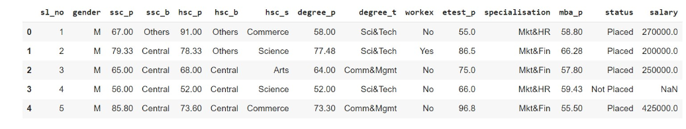
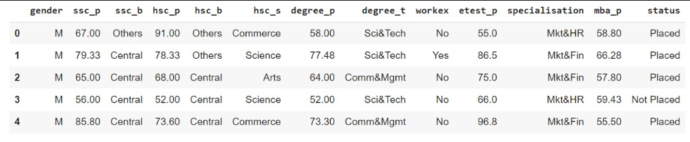
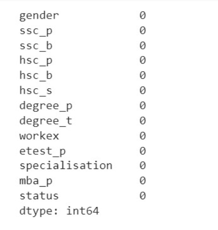
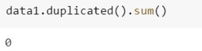
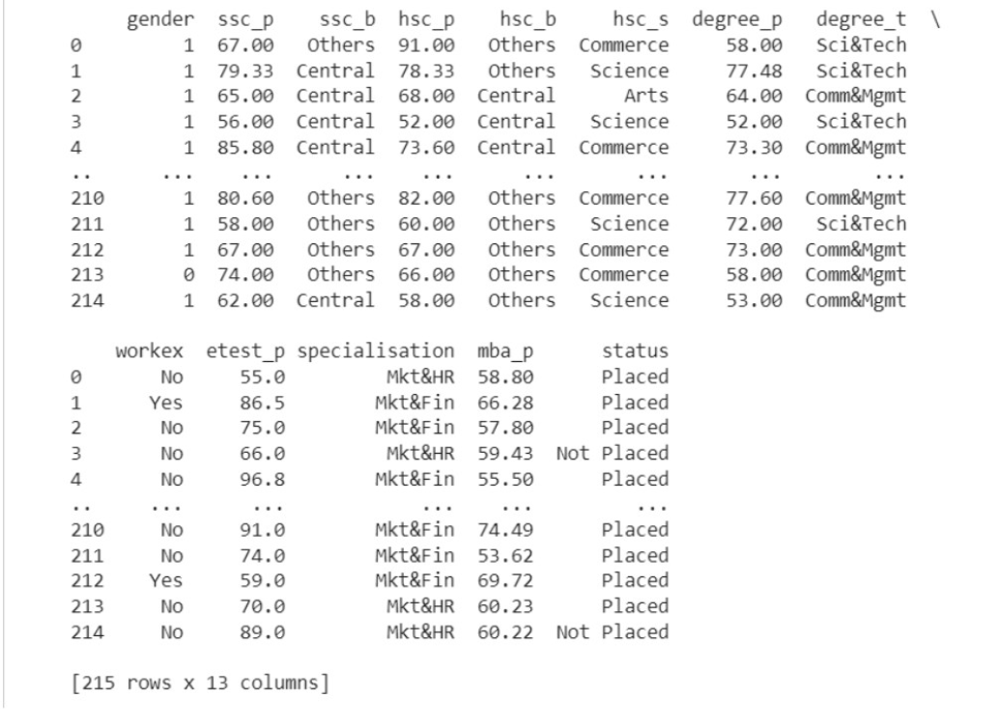
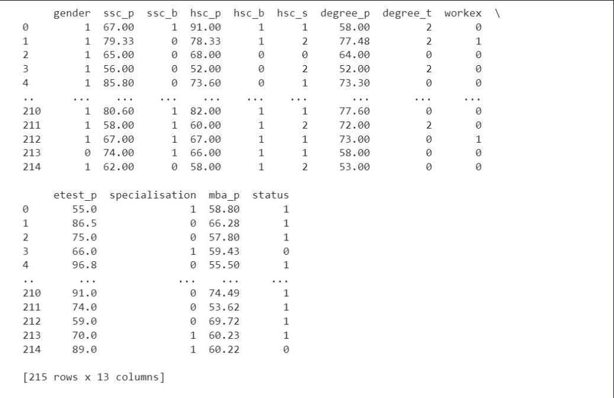
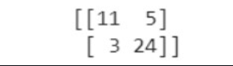
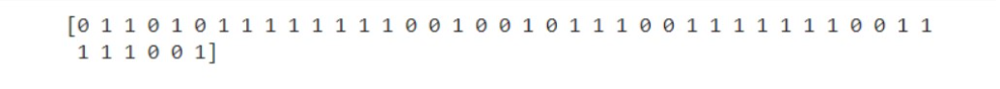

# Implementation-of-Logistic-Regression-Model-to-Predict-the-Placement-Status-of-Student

## AIM:
To write a program to implement the the Logistic Regression Model to Predict the Placement Status of Student.


## Equipments Required:
1. Hardware – PCs
2. Anaconda – Python 3.7 Installation / Moodle-Code Runner

## Algorithm
1. Import pandas library to read CSV or excel files.

2. Import LabelEncoder using sklearn.preprocessing library.
3. Import LabelEncoder using sklearn.preprocessing library.
4. Import Logistic regression module from sklearn.linear_model library to predict the values.
5. Find accuracy, confusion matrix ,and classification report using sklearn.metrics library.
6. Predict for the new given values. End of the program.

## Program:
```
/*
Program to implement the the Logistic Regression Model to Predict the Placement Status of Student.
Developed by: KRISHNA PRAKAASH D.M
RegisterNumber:  212221230052
*/


import pandas as pd
data=pd.read_csv("Placement_Data.csv")
data.head()
data1=data.copy()
data1=data1.drop(["sl_no","salary"],axis=1)
data1.head()
data1.isnull().sum()
data1.duplicated().sum()

from sklearn.preprocessing import LabelEncoder
le=LabelEncoder()
data1['gender']=le.fit_transform(data1["gender"])
data1['ssc_b']=le.fit_transform(data1["ssc_b"])
data1['hsc_b']=le.fit_transform(data1["hsc_b"])
data1['hsc_s']=le.fit_transform(data1["hsc_s"])
data1['degree_t']=le.fit_transform(data1["degree_t"])
data1['workex']=le.fit_transform(data1["workex"])
data1['specialisation']=le.fit_transform(data1["specialisation"])
data1['status']=le.fit_transform(data1["status"])
print(data1)

x=data1.iloc[:,:-1]
x
y=data1["status"]
y

from sklearn.model_selection import train_test_split
x_train,x_test,y_train,y_test=train_test_split(x,y,test_size=0.2,random_state=0)

from sklearn.linear_model import LogisticRegression
lr=LogisticRegression(solver="liblinear")
lr.fit(x_train,y_train)
Y_pred=lr.predict(x_test)
print(Y_pred)

from sklearn.metrics import accuracy_score
accuracy = accuracy_score(y_test,Y_pred)
accuracy

from sklearn.metrics import confusion_matrix
confusion = confusion_matrix(y_test,Y_pred)
print(confusion)

from sklearn.metrics import classification_report
classification_report1= classification_report(y_test,Y_pred)
print(classification_report1)

print(lr.predict([[1,80,1,90,1,1,90,1,0,85,1,85]]))
```

## Output:
## Initial DataFrame (Placement_Data.csv)::

## Dropping "Salary" column from DataFrame:

## Sum of null data present in each column:

## Sum of Duplicate data present in each column:

## Applying LabelEncoder:

## After applying LabelEncoder for each Label column:

## Accuracy:

## Confusion Matrix:

## Class Report:

## Y Prediction:

## lr Prediction:

## Result:
Thus the program to implement the the Logistic Regression Model to Predict the Placement Status of Student is written and verified using python programming.
